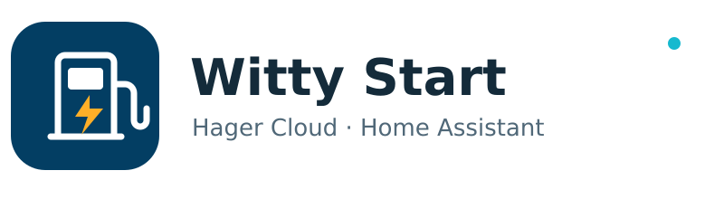

  <picture>
    <source media="(prefers-color-scheme: dark)" srcset="docs/assets/logo-dark.svg">
    
  </picture>

<h1 align="center">Hager Witty Start · Home Assistant</h1>

Consultez votre borne, suivez la session et démarrez ou arrêtez la charge depuis Home Assistant.

<a href="README.md">English</a> · <strong>Français</strong>

Intégration non officielle pour les bornes **Hager Witty Start** connectées à **Hager Cloud**. Installation comme dépôt personnalisé HACS pour recevoir les notifications de mise à jour. Projet communautaire indépendant, sans affiliation ni validation de Hager.

## En un coup d’œil

| Fonction | v0.1.0 |
|---|---|
| Commande de charge | Un seul interrupteur **Charge** : démarrer / arrêter |
| État de la borne | Lecture du cloud toutes les 10 secondes par défaut |
| Données de session | Énergie, coût, durées, autonomie récupérée, dates, selon les données Hager |
| Authentification | Connexion Hager OAuth 2.0 / PKCE ; renouvellement automatique des jetons |
| Configuration | Interface Home Assistant en français et en anglais |
| Diagnostic | Code événement, transitions d’état, téléchargement de données masquées |

## Prérequis et périmètre

- Home Assistant **2026.10.0 ou supérieur**.
- Une Witty Start connectée au cloud, déjà visible et pilotable dans l’application Hager Witty, et le compte Hager correspondant.
- Un accès Internet de Home Assistant aux services Hager.
- HACS, ou un accès au dossier de configuration HA pour une installation manuelle.

Cette version gère la borne retournée par l’API du compte. Les comptes avec plusieurs bornes et les autres modèles Witty ne sont pas validés. Elle ne règle ni l’intensité, ni les phases, ni la puissance, ni les horaires de la borne. Elle ne fournit pas de connexion locale/OCPP, de gestion automatique du surplus solaire, de SOC du véhicule ou de mesure de puissance instantanée.

## Installation HACS

1. Dans **HACS → Dépôts personnalisés**, ajouter `https://github.com/yg-dev-ha/hager-witty-home-assistant`, catégorie **Integration**.
2. Télécharger **Hager Witty Start**, puis redémarrer Home Assistant.
3. Ouvrir **Paramètres → Appareils et services → Ajouter une intégration → Hager Witty Start**.

### Installation manuelle et migration

Télécharger `hager-witty-v0.1.0.zip` depuis les [Releases](https://github.com/yg-dev-ha/hager-witty-home-assistant/releases). Extraire `custom_components/hager_witty` dans le dossier de configuration HA. Le chemin final doit être `/config/custom_components/hager_witty/manifest.json`. Redémarrer HA, puis ajouter l’intégration.

Pour passer d’une installation manuelle à HACS, sauvegarder le dossier, installer avec HACS et redémarrer. Conserver l’entrée de configuration existante : le domaine et les identifiants uniques des entités sont préservés. Éviter un dossier `hager_witty` imbriqué dans un autre.

## Connexion Hager

1. Choisir le pays du compte et la langue (`FR` / `fr` par défaut).
2. Ouvrir le lien **Connexion Hager** dans un nouvel onglet et s’authentifier sur la page Hager.
3. La redirection finale utilise `com.miaaguardusercontent…:/callback`. Un navigateur sur PC peut indiquer qu’il ne sait pas ouvrir ce lien d’application.
4. Copier **l’URI callback complète** dans Home Assistant. Il est aussi possible de coller uniquement la valeur entre `code=` et le prochain `&`.

Le callback complet est préférable : sa destination et son paramètre OAuth `state` sont vérifiés. Le code seul reste accepté avec PKCE, mais ne permet pas de vérifier `state`. Utiliser le code de cette tentative de configuration, une seule fois. Si le navigateur masque le callback, ouvrir ses outils de développement → Réseau, activer la conservation du journal et consulter l’en-tête `Location` de la dernière redirection. Ne jamais partager cette URL ou une capture réseau.

Si le code expire, rouvrir le lien de connexion. Si la recherche de la borne échoue temporairement **après** l’échange du code, soumettre à nouveau le formulaire : la configuration en cours conserve les jetons pour ce nouvel essai. Aucun mot de passe Hager n’est enregistré par l’intégration.

## Entités et fonctionnement

| Entité | Comportement |
|---|---|
| **Charge** | ON si la charge est confirmée ; OFF si le véhicule est branché et à l’arrêt ; indisponible si débranché ou état inconnu |
| **En charge** | Vrai/faux pour les codes connus ; **inconnu** pour les codes non classifiés |
| **État / Code événement** | Description Hager, code brut et attributs de l’événement |
| **Énergie de session** | Valeur de session en kWh ; ce n’est pas un compteur cumulatif pour le tableau Énergie |
| **Coût de session** | Valeur Hager avec la devise configurée dans HA, sans conversion : vérifier qu’elle correspond à celle du compte |
| **Durée de connexion / charge** | Durées brutes retournées par Hager |
| **Autonomie récupérée** | Estimation Hager en km |
| **Début / fin de session** | Dates du cloud ; les valeurs absentes ou sans fuseau restent inconnues |
| **Expiration du jeton** | Diagnostic désactivé par défaut |

L’état suit les informations retournées par Hager. L’acceptation d’une commande ne confirme pas immédiatement son effet physique. Après un délai d’attente dépassé, vérifier la borne ou l’application avant de réessayer. La commande cloud n’est pas un arrêt d’urgence.

### Codes observés sur une Witty Start

| `StatusEvent.Type` | Description Hager | Signification |
|---:|---|---|
| 2006 | Borne disponible | Véhicule débranché |
| 2007 | Véhicule disponible | Branché, sans charge |
| 2009 | Véhicule en charge | Charge en cours |

Une session ouverte (`EndDate = null`) ne prouve pas qu’une charge est active. Les autres codes sont journalisés sans supposer leur sens. Si Hager renvoie une autre borne que celle configurée, les entités deviennent indisponibles plutôt que d’afficher ses données sous une mauvaise identité.

## Réglages, mises à jour et dépannage

Intervalle configurable de **2 à 300 secondes**, **10 s** par défaut. Réserver 2 s aux diagnostics courts : cela ne supprime pas le délai de mise à jour du cloud Hager. HACS propose les versions publiées ; installer la mise à jour, puis redémarrer HA.

| Symptôme | Vérification |
|---|---|
| Intégration indisponible | Application/cloud Hager, puis journaux HA ; les lectures reprennent automatiquement |
| Interrupteur indisponible | Câble et code événement ; les états inconnus désactivent la commande |
| Réauthentification demandée | Se reconnecter : le refresh token a été refusé ou est absent |
| API 401/403 persistant | Un renouvellement et un nouvel essai sont effectués ; un refus persistant est signalé sans imposer immédiatement une reconnexion |
| Nouveau code événement | Utiliser le [formulaire dédié](https://github.com/yg-dev-ha/hager-witty-home-assistant/issues/new/choose) et décrire l’état réel du véhicule |

Activer temporairement le journal de débogage depuis le menu de l’intégration. Transitions : INFO ; codes inconnus : WARNING. Les diagnostics masquent jetons, identifiants et noms de borne, et excluent le profil du compte. Relire les descriptions libres du cloud et les journaux avant de les partager.

## Confidentialité et état du projet

Les jetons OAuth sont enregistrés dans la configuration HA et les renouvellements sont sauvegardés. Protéger la configuration et ses sauvegardes. Les corps des réponses HTTP ne sont pas inclus dans les messages d’erreur. Les identifiants applicatifs et la clé de souscription API inclus dans le code proviennent du protocole de l’application mobile ; ce ne sont pas une clé développeur personnelle et ils peuvent changer côté Hager.

Première version issue d’observations sur Witty Start. Les tests hors ligne couvrent OAuth, le renouvellement et les nouveaux essais, ainsi que les états observés. GitHub exécute ces tests, HACS et Hassfest. Cela ne remplace pas une validation sur la borne et ne garantit pas tous les comptes ou pays.

[Historique](CHANGELOG.md) · [Contribuer](CONTRIBUTING.md) · [Licence MIT](LICENSE). Hager et Witty sont des marques de leurs propriétaires respectifs.
